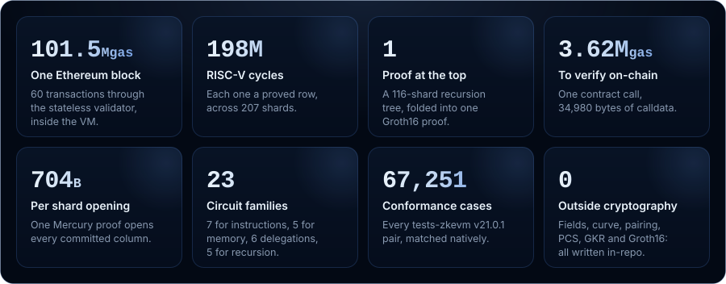
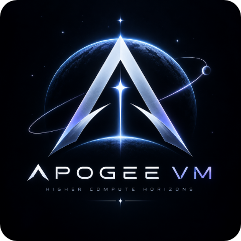

<p align="center">
  <a href="https://apogee.gweb3networks.com/docs"></a>
</p>

<h1 align="center">Every application can be blockchain-native.</h1>

<p align="center">
  <b>Apogee VM is a RISC-V zkVM that proves Rust programs ran correctly and settles one proof on Ethereum.</b>
</p>

<p align="center">
  You write ordinary Rust. Apogee runs it on a RISC-V machine, proves every instruction it executed,
  and hands the chain one proof that a single contract call can check. Correctness stops being
  something your users trust and becomes something they verify.
</p>

<p align="center">
  <a href="https://apogee.gweb3networks.com/docs"><b>Documentation</b></a>
  &nbsp;·&nbsp;
  <a href="https://apogee.gweb3networks.com/docs/launch/quickstart">Quickstart</a>
  &nbsp;·&nbsp;
  <a href="https://apogee.gweb3networks.com/docs/architecture">Architecture</a>
  &nbsp;·&nbsp;
  <a href="https://apogee.gweb3networks.com/docs/auditors">Specification</a>
  &nbsp;·&nbsp;
  <a href="https://apogee.gweb3networks.com/docs/at-a-glance">At a glance</a>
</p>

<br>

## Proof of correctness

**Software has always asked to be trusted. Apogee lets it be checked instead.**

Whenever a program runs on someone else's machine, its users take the result on faith: the ledger,
the order book, the payout, the roll of the dice. Blockchains removed that faith for one narrow
kind of program by having every node re-run every transaction. It works. It is also the most
expensive way ever devised to agree on anything.

A zkVM, a virtual machine that proves its own execution, removes the faith for any program. The
program runs once, anywhere, and leaves behind a mathematical receipt: *this program, given this
input, produced this output*. Checking that receipt never means running the program again.

| 01 · Energy | 02 · Capital | 03 · Mathematics, now |
| --- | --- | --- |
| **Proof of Work.** Electricity secures the order of events. | **Proof of Stake.** Capital secures the order of events. | **Proof of Correctness.** Mathematics secures the events themselves. |

Work and stake decide which history counts; neither checks what happened inside it. A validity
proof retires that last brute force. Energy, then capital, then mathematics: there is no fourth
thing left to stop trusting.

## What changes

**Your product, its own chain, and mathematics as the referee.** The blockchain-native future is
not one chain doing everything. It is many environments, each shaped around one application, all
settling to the same base layer. Apogee is the proof engine that makes running one practical.

- **Write** your logic in ordinary Rust. A guest is a `no_std` binary for RISC-V that reads its
  input, does its work and commits its output. Apogee proves each run; you never think in circuits.
- **Settle** without a waiting room. A validity proof is final the moment it verifies: no
  seven-day dispute window, and no committee or enclave standing in for the mathematics.
- **Specialize** the environment around your product. Apogee proves any program built for its
  machine, so the state-transition function is yours to define.

## Measured, not promised

**A full Ethereum block, from guest to contract.** Apogee v1.0.0 was proved end to end on block
257,510 of `glamsterdam-devnet-8`. The block was validated statelessly inside the VM under the
execution-specs rules, then folded by recursion into one proof that an Ethereum contract accepts.

<p align="center">
  
</p>

<sub>The base proof took 2,481 s on a 32-vCPU machine and peaked at 174 GiB; the recursion tree
took about 2,620 s more. Every figure is the specification's: [streaming](docs/spec/streaming.md)
§1 and [recursion](docs/spec/recursion.md) §10.</sub>

## The path of a proof

**You write the program. Apogee does everything after it.** Between your Rust and the contract's
`true` sit a decoder, 23 circuit families, the GKR engine, the commitments, a recursion tree and a
Groth16 decider. None of it is yours to build or maintain.

<p align="center">
  
</p>

<sub>Everything inside the dashed frame is Apogee's. Figures are block 257,510's.</sub>

## Under the hood

A proof that verifies states four things about one run:

- **Program**: its identity, one field element that digests the code, the initial memory image,
  the entry point and the circuit configuration.
- **Input**: the public bytes the program was given.
- **Output**: the journal, the bytes it chose to publish.
- **Exit**: the status it ended with; `0` is success.

A verifier takes the identity from its own channel, never from the prover. The machinery that
makes the statement hold:

- **The machine.** RV32IMAC on one hart: the 59 instructions of RV32IMA, compressed instructions
  expanded at load. Guests are `#![no_std]` Rust with `alloc`.
- **Arithmetization.** 23 circuit families over BN254's scalar field, each a layered GKR circuit:
  seven for instructions, five for memory windows, six **delegations** (Keccak-f, SHA-256,
  Poseidon2, field and curve arithmetic) and five for recursion. Gates are checked by sumcheck,
  memory by one read/write multiset over the whole execution, lookups by LogUp.
- **Commitments.** Mercury, a multilinear scheme over KZG with a constant-size opening, on the PSE
  powers-of-tau ceremony. No FRI, no hash-based commitment.
- **Fiat–Shamir.** A Poseidon2 duplex transcript.
- **Scale.** Each family's rows are cut into shards of `2^8` to `2^22` rows, each proved by its
  family's circuit and opened in one batched opening. A two-pass streaming prover keeps its memory
  to the shards in flight, not the length of the execution.
- **Settlement.** Verifier programs, proved by this VM, verify runs of shards and fold their
  deferred pairings up a tree; a Groth16 decider re-verifies the root, and `ApogeeVerifier.sol`
  checks that proof and the folded pairing in one call.
- **No outside cryptography.** Fields, curve, pairing, MSM, hash, PCS, GKR and Groth16 are
  implemented here; arkworks, Plonky3 and zkhash appear only as test oracles.
- **Ethereum as the reference workload.** A revm guest with a mini-block binary and a stateless
  validator for Osaka, BPO1, BPO2 and Amsterdam ([ethereum](docs/spec/ethereum.md)).

**Where v1.0.0 stops.** Proofs are succinct, not zero-knowledge: nothing is blinded. Advice is
unbound by design, so a guest checks it against something a proof binds. Proving is memory-bound
today. The [security model](https://apogee.gweb3networks.com/docs/architecture/security) gives
every limit with its reason.

## The quantum leap

**v1.0.0 settles whether the architecture holds at full scale. v2.0.0 changes what it rests on.**
A validity proof is only as quantum-safe as the system that produces it, and blockchain-native
applications are meant to hold value for decades. The work toward v2.0.0 is underway:

| | v1.0.0, today | v2.0.0, the trajectory |
| --- | --- | --- |
| **Commitments** | Mercury over KZG: pairings, q-DLOG | Lattice-based, binding under Module-SIS |
| **Field** | BN254's scalar field, 254 bits | A small prime field matched to the commitment |
| **Against a quantum adversary** | Every assumption is a discrete logarithm | A proving core resting on lattice problems |
| **Signatures in guests** | secp256k1 through delegated field and curve arithmetic | Zk-friendly and post-quantum schemes as guest calls |
| **For builders** | A repository, its tools and a manual | The Deployment System: portal, canonical bridges, telemetry, an AI gateway |

The leap is in the foundations, not in the model a builder writes against: programs written for
v1.0.0 keep their shape, and nothing on the road changes v1.0.0's guarantees.
[Follow the trajectory →](https://apogee.gweb3networks.com/docs/quantum-leap)

## Launch

**From a clean checkout to the one proof a contract accepts.** Proving needs the ceremony file
`assets/ptau/ppot_0080_24.ptau` ([srs](docs/spec/srs.md) §1) and a machine with tens of GiB.

```sh
# Build a guest for the machine
(cd guests/fib && cargo build --release --target riscv32imac-unknown-none-elf)

# Prove a mainnet mini-block, and verify it
cargo run --release -p bench -- prove mini-block --out <dir>
cargo run --release -p verifier -- block <stem>.vk <identity-hex> <stem>.public <stem>.block

# Fold it up the recursion tree; the ceremony and the decider follow (docs/spec/recursion.md §10)
cargo run --release -p bench -- recurse <dir>/<stem> --out <out>
```

Writing your own guest? The [quickstart](https://apogee.gweb3networks.com/docs/launch/quickstart)
goes from an empty crate to a verified proof with the real output of every step, and the
[guest program manual](docs/guest-program-manual.md) covers the rest.

## Documentation

The documentation lives at **[apogee.gweb3networks.com](https://apogee.gweb3networks.com/docs)**,
in English, French (Canada), Simplified Chinese and German: one system, read from six directions.

| You are | Start with |
| --- | --- |
| A builder | **[Launch your app](https://apogee.gweb3networks.com/docs/launch)**: write a guest, build it, run it, prove it |
| An architect or CTO | **[Architecture](https://apogee.gweb3networks.com/docs/architecture)**: how the program, the GKR engine, the commitments, the memory argument and recursion fit together |
| An auditor | **[Auditors](https://apogee.gweb3networks.com/docs/auditors)**: every column, gate and lookup, a soundness map, and the trust boundary drawn crate by crate |
| A decision maker | **[At a glance](https://apogee.gweb3networks.com/docs/at-a-glance)**: what it proves, what it costs, what it assumes and where it stops |
| A strategist | **[Quantum Leap](https://apogee.gweb3networks.com/docs/quantum-leap)**: where v2.0.0 is headed |
| An AI agent | **[AI Companion](https://apogee.gweb3networks.com/docs/launch/ai-companion)** and [`llms.txt`](https://apogee.gweb3networks.com/llms.txt) |

The normative specification lives here, in the repository.
[docs/architecture.md](docs/architecture.md) is the place to start: what a proof states, how
soundness composes, what it assumes, its limits and its measured cost. The specification is
[docs/spec/](docs/spec/), one page per subject, mapped to the code below;
[docs/glossary.md](docs/glossary.md) indexes the vocabulary,
[docs/guest-program-manual.md](docs/guest-program-manual.md) walks through writing and proving a
guest, and [docs/tools.md](docs/tools.md) covers every binary. Source comments cite the spec by
section (`docs/spec/memory.md` §2.4); where a page and the code disagree, the code is right.

## The repository

Every crate has one page of the specification that owns it.

<details>
<summary><b>The crate map</b>: what each path is, and where it is specified</summary>

<br>

| path | what it is | specified in |
| --- | --- | --- |
| `crates/constants` | every protocol constant, tag and identifier; no logic | the page that uses each |
| `crates/field`, `curve`, `poly`, `sumcheck` | `Fr`; the `Fq` tower, G1/G2, pairing, MSM; multilinear polynomials; zerocheck | [primitives](docs/spec/primitives.md) |
| `crates/transcript` | Poseidon2 and the duplex transcript | [transcript](docs/spec/transcript.md) |
| `crates/srs` | ceremony ingestion, the SRS archive, KZG, Groth16's phase 1 | [srs](docs/spec/srs.md) |
| `crates/pcs`, `pcs-verify` | Mercury and deferred verification; `pcs-verify` is verification's field side | [mercury](docs/spec/mercury.md) |
| `crates/loader`, `isa`, `program` | ELF to `ProgramImage`; the decoder; decoded tables, `VmConfig`, program identity | [program](docs/spec/program.md) |
| `crates/emulator`, `trace` | the executor and its tracers; rows, memory state, column builders | [execution-trace](docs/spec/execution-trace.md) |
| `crates/constraints` | every circuit as data: memory frames, lookup channels, the family circuits, the registries | [gkr](docs/spec/gkr.md), [memory](docs/spec/memory.md), [lookup](docs/spec/lookup.md), [circuits](docs/spec/circuits.md) and the family pages |
| `crates/gkr-verify`, `gkr` | the GKR verifier and prover | [gkr](docs/spec/gkr.md) |
| `crates/verifier-core` | statement, transcripts, verifying key, every check of a shard and a block but the opening; recursion's tapes, nodes and folding | [proof](docs/spec/proof.md), [recursion](docs/spec/recursion.md) |
| `crates/verifier` | `verify_shard`, `verify_block`, the proof archive, the `verifier` CLI | [proof](docs/spec/proof.md) |
| `crates/prover` | key construction, column fills, the streaming prover, the debug log | [streaming](docs/spec/streaming.md) |
| `crates/groth16` | Groth16 with bound wires and a two-phase ceremony | [recursion](docs/spec/recursion.md) §9 |
| `crates/host` | the host SDK: setup, prove, verify; the block-witness recorder; the recursion tree and decider | [ethereum](docs/spec/ethereum.md), [recursion](docs/spec/recursion.md) |
| `crates/checker` | independent validators of the circuit laws, native lookup and memory evaluators, the tamper harness, the `checker` CLI | [circuits](docs/spec/circuits.md) §3 |
| `crates/guest-sdk` | the guest runtime: entry, linker script, allocator, memory regions, delegation shims | [ecall-abi](docs/spec/ecall-abi.md), [delegation](docs/spec/delegation.md) |
| `guests/` | test and workload guests, a workspace of their own; `vendor/` holds patched upstream crates | [manual](docs/guest-program-manual.md), [vendor](guests/vendor/README.md) |
| `contracts/` | `ApogeeVerifier.sol` | [recursion](docs/spec/recursion.md) §9 |
| `tools/` | `kat-gen`, `bench`, `profiler`, `artifact-dump`, `test-support`; `transcript-ref` and `stateless-ref`, independent oracles outside the workspace | [tools](docs/tools.md) |
| `docs/publication/` | the papers the PCS and the pairing follow | [mercury](docs/spec/mercury.md), [primitives](docs/spec/primitives.md) |

The circuit families are specified in [add-sub](docs/spec/add-sub.md),
[jump-branch-slt](docs/spec/jump-branch-slt.md), [shift-bitwise](docs/spec/shift-bitwise.md),
[mul-div](docs/spec/mul-div.md), [memory-ops](docs/spec/memory-ops.md),
[public-values](docs/spec/public-values.md), [delegation](docs/spec/delegation.md) and
[delegation-circuits](docs/spec/delegation-circuits.md).

</details>

## Build and test

- The toolchain, its components and the `riscv32imac-unknown-none-elf` target are pinned in
  `rust-toolchain.toml`; `rustup` installs them on first use.
- Program identity, real keys and proving need the ceremony file `assets/ptau/ppot_0080_24.ptau`
  ([srs](docs/spec/srs.md) §1). The workspace tests do not.
- Proving is memory-bound: a full block peaked at 174 GiB ([streaming](docs/spec/streaming.md) §1).

```sh
# What CI runs (.github/workflows/ci.yml is the full list)
cargo fmt --all -- --check
cargo clippy --workspace --all-targets -- -D warnings
cargo test --workspace
cargo run -p kat-gen && git diff --exit-code     # committed fixtures regenerate identically

# Guests: their own workspace and target
(cd guests && cargo clippy --bins -- -D warnings)
(cd guests/fib && cargo build --target riscv32imac-unknown-none-elf)   # --release for proving
```

<details>
<summary><b>The proving suites</b>: outside CI, run by hand</summary>

<br>

The suites that prove real shards are `#[ignore]`d and CI does not run them: each proves over a toy
SRS of its own and needs tens of GiB.

```sh
cargo test --release -p prover --test <suite> -- --include-ignored --test-threads=1
#   acceptance, control, alu, mem, fills, block, streaming, keccak, recursion, public_io, revm
cargo test --release -p host --test prove -- --include-ignored --test-threads=1   # a mainnet mini-block
cargo test --release -p checker --test tamper -- --include-ignored --test-threads=1   # every tamper twin
```

</details>

<br>

<p align="center">
  
</p>

<h3 align="center">The first step is a program.</h3>

<p align="center">
  Write it in Rust and run it on Apogee. Everything after that, from the shards and the circuits to
  the recursion and the contract, is the machine's job. What reaches the chain is a proof, and a
  proof is all the chain needs.
</p>

<p align="center">
  <a href="https://apogee.gweb3networks.com/docs/launch/quickstart"><b>Begin the quickstart →</b></a>
  &nbsp;&nbsp;·&nbsp;&nbsp;
  <a href="https://www.gweb3networks.com/thesis.html">Read the thesis ↗</a>
</p>

<p align="center">
  <sub>Apogee VM is the flagship of <a href="https://www.gweb3networks.com">G Web3</a>'s research program toward blockchain-native application environments.</sub>
</p>
